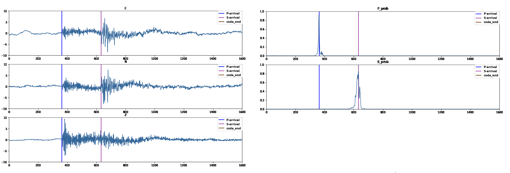

## 微震拾取实验

模型通过输入长度为16秒(100hz)的三分量地震波形实现P波、S波初至时间的精确和快速拾取，同时对噪声有一定鲁棒性，不需滤波处理也能在2级以下的地震事件(或非天然地震)上有良好表现。

## 输入/输出

将一段16秒长的三分量波形数据转换为shape为(1,3,1600)的tensor，并对三个分量做标准化作为输入

模型输出shape为(1,2,1600)，代表对应时间点为P/S波初至时刻的概率

## 网络结构

## 选取数据

训练过程使用STEAD数据集，从中挑选300000条世界不同地区的2级以下地震波形数据

##  模型效果

对于大部分干净或有微小背景噪声的信号，拾取效果良好

对于信噪比极低（背景噪声大或地震波能量弱）的信号拾取效果稍弱，在实际使用中如果噪声为台站设备本身引起可适当降低阈值。

这儿放数据
